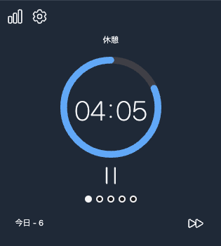
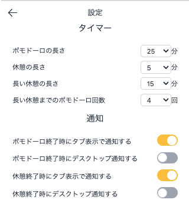

# LT

---

# 🎉 次来る Chrome 拡張特集（仮）

---

## 今日はネクストブレイク必至の chrome 拡張を紹介。

---

# hack-timer ⏰

---

## ポモドーロテクニック

> ポモドーロ・テクニック（英: Pomodoro Technique、ポモドーロ法）とは、1980 年代にイタリア人のフランチェスコ・シリロ（フランチェスコ・チリッロ、伊: Francesco Cirillo）によって考案された時間管理術。

> このテクニックではタイマーを使用し、一般的には 25 分の作業と短い休息で作業時間と休息時間を分割する。1 セットを「ポモドーロ」と呼ぶ。これはイタリア語で「トマト」を意味する言葉で、シリロが大学生時代にトマト型のキッチンタイマーを使用していたことにちなむ。

https://ja.wikipedia.org/wiki/%E3%83%9D%E3%83%A2%E3%83%89%E3%83%BC%E3%83%AD%E3%83%BB%E3%83%86%E3%82%AF%E3%83%8B%E3%83%83%E3%82%AF

---

## 👍 推しポイント 3 つ

---

## ① シンプルかつ直感的な UI ✨

<ul>
<li>余計な装飾を廃したユーザーフレンドリーな</li>
<li>ダークモードにも対応 🌗</li>
</ul>

---

## ② 痒い所に手が届く機能 ✅

<ul>
<li>履歴のトラッキング、バックアップ 📊</li>
<li>デスクトップ通知、タブ通知 🔔</li>
<li>新機能も随時リリース予定</li>
</ul>

---

## そして 3 つ目は

---

## ③ 自作です

---

## 自作自演乙

---

# 技術スタック

- React + TypeScript
- Tailwind CSS
- CRXJS Vite Plugin

---

## ちょっと苦労したとことか

- background でカウント維持するのどうやるん？
- ***

---

# 雑感

- 初 Chrome 拡張開発、思ったより DX 良き
-
- ちょっとでも気になった人は使ってみてください、お願いします（懇願）

---

# EOF
