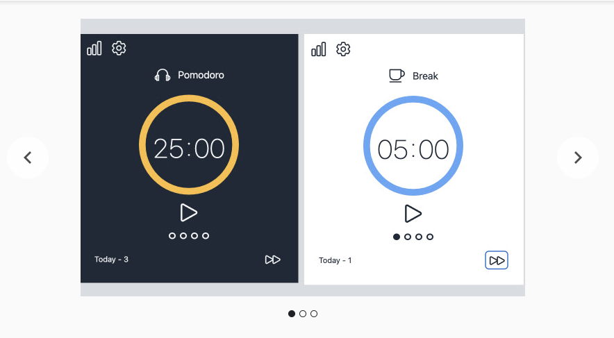

<!--
class: center invert
-->

# LT

---

<!-- class: normal invert -->

## Mimura Akito

#times-mimu

- HN：mimu
- 年齢：26
- 出身：大阪
- 趣味：ストリートダンス、お酒

---

## 前職

- 新卒でバックエンドのエンジニアを 3 年
  - レガシーシステムのフルリプレイス
  - API の設計、開発
  - 業務支援 Saas の保守開発

---

## 転職動機

- エンジニアが少ない、営業の声が大きい
- 技術的に強い人からどんどん離れていく
- クライアントやエンドユーザーの姿が想像しづらい

---

## NBX の入社理由

- フロントエンドに強い
- コミュニティ活動に熱心
- リクルート案件に関われる

---

## 特徴

- 得意
  - 自己解決
  - 人助け
- 苦手
  - 人に甘える、頼る
  - 人前で話す

---

## モチベーション

- フロントエンドスキルをゴリゴリに磨きたい 💪💪
- エンジニアとの繋がりをガンガン増やしたい 👬👫
- 組織、コミュニティにバチバチに貢献したい ⤴⤴️

---

## 個人のアウトプットなど

https://mimu-memo.com/

---

https://chrome.google.com/webstore/detail/hack-timer/pcnppkgggfifkggfbikfacnheemmlbfa

---

<!-- _class: center invert -->

# EOF
