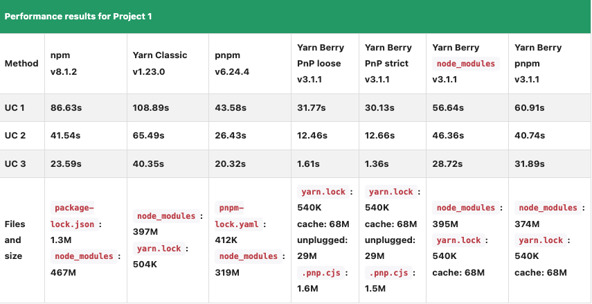

<!--
class: center invert
-->

# npm/yarn/pnpm ゆるふわ解説

---

<!--
class: invert
-->

## Goal

- Node のパッケージマネージャー（PM）の仕様差異をなんとなく理解する
- パッケージの依存関係の管理の仕組みについてやんわり理解する

---

## 各 PM 詳細

- npm
- yarn(v1, v2~)
- pnpm

---

## npm

- 言わずと知れた ポピュラーな PM
- 2023/08/20 現在の latest version は v9.8.0
- 2020 年に Github が買収し、現在は MS 管理下にある
- 「npm is not an acronym」を再帰的に表したものであり、「Node Package Manager」の頭文字を表しているものではないらしい
  - https://github.com/npm/cli#faq-on-branding

---

## Yarn(v1, classic)

- 2016 年に当時の Facebook と Google を中心に開発
- 下記の特徴が革新的だった
  - 依存関係の木構造が普遍（後述）
  - ロックファイル導入によるバージョン固定
    - 依存解決（node_modules 配下の構造）の非決定性の対策
- 2020 年に本バージョン(v1)はメンテナンスモード対象となった
  - https://classic.yarnpkg.com/en/docs/install#mac-stable
  - 2023/08/20 現在の latest version は v3.6.2

---

## pnpm

- 2017 年に OSS として release
- pnpm = performant npm
- 2023/08/20 現在の latest version は v8.6.12
- ディスク使用量の効率化が主眼（後述）
  - ref: https://pnpm.io/motivation
  - パッケージの巻き上げ（hoisting） の代わりに symlink を活用

---

## Yarn (v2, Berry)

- 2020 年に yarn v2 が release
- Plug’n’Play (PnP)の導入（後述）
  - node_modules を作らず、代わりに依存関係のマッピング用のファイルを使用することでパフォーマンス向上、ディスク容量を効率化

---

## 各 PM の比較観点

- パフォーマンス
- ディスク効率性
- セキュリティ
- ...etc

---

## node_modules のディレクトリ構造

### 前提

- install 実行で node_modules/配下に依存パッケージが配置される
- Node はパッケージの探索時（パスの解決時）、パッケージが見つかるまで親ディレクトリの node_modules を再帰的に探しに行く
  - ref: https://nodejs.org/api/modules.html#modules_loading_from_node_modules_folders

---

## npm/yarn(classic)

- 依存関係は木構造になっている（DOM ツリー的な）
- 依存関係内の重複パッケージは hoisting（巻き上げ）によって flat に配置される（なるべく階層が浅くなるように保つ）
  - 特に Windows ではパス文字列が 256 文字の制限に引っかかるらしい（[パスの最大長の制限](https://learn.microsoft.com/ja-jp/windows/win32/fileio/maximum-file-path-limitation?tabs=registry)）
  - 重複パッケージの削除 = dedupe
- 異なるバージョンでも同名パッケージの場合は hoisting が出来ない（同名で同階層に作れない）

---

<!--
class: center invert
-->

<div style="display: flex; width: 100%; justify-content: space-between; gap: 20px; align-items: start;">
<div style="flex-direction: column; width: 50%;">
before

```
node_modules/
　 ├ A(v1.0.0)
　 │ └ node_modules/
　 │ 　 └ B(v1.0.0)
　 ├ C(v1.0.0)
　 │ └ node_modules/
　 │ 　 └ A(v1.0.0)
　 │ 　 　 └ node_modules/
　 │ 　 　 　 └ B(v1.0.0)
　 └ D(v1.0.0)
　 　 └ node_modules/
　 　 　 └ B(v2.0.0)
```

</div>

<div style="flex-direction: column;  width: 50%">

after

```
node_modules/
　 ├ A(v1.0.0)
　 ├ B(v1.0.0)
　 ├ C(v1.0.0)
　 └ D(v1.0.0)
　 　 └ node_modules/
　 　 　 └ B(v2.0.0)
```

</div>
</div>

---

<!--
class: invert
-->

## pnpm

- hoisting の代わりに symbolic link を活用
  - install したパッケージは global な.pnpm_store 内に配置され、hard link される
  - 木構造内の重複パッケージは sym link で使い回す

---

## e.g.

```
node_modules
     └── .pnpm
         ├── bar@1.0.0
         │   └── node_modules
         │       └── bar -> <store>/bar
         └── foo@1.0.0
             └── node_modules
                 ├── foo -> <store>/foo
                 └── bar -> ../../bar@1.0.0/node_modules/bar
```

---

## Yarn berry

- Plug'n'Play(PnP)というインストール戦略を採用（node_modules と対比）
  - node_modules を作らず、代わりにモジュールパスのマッピング用の pnp.cjs を作成することでパフォーマンスの向上、ディスク容量の効率化になる
  - さらに各パッケージを zip 化しプロジェクトの`.yarn/cache/`配下に配置、git push することで各々の install 作業が不要になる
- 従来通り node_modules 管理にすることも可能
  - ref: https://sg.wantedly.com/companies/wantedly/post_articles/325643

---


## パフォーマンス

https://blog.logrocket.com/javascript-package-managers-compared/




---


## 未調査

- pnp モードかつ not zero-install 時のメリットは何か？
- yarn/cache 配下の zip を展開せずにロードする方法はどうやっているか？
  - pnp ローダーがキャッシュパスを介して直接パッケージを参照するとは？
- volta では yarn v2 を install しようとすると非推奨のエラーとなり v3 を推奨してくる。なぜか？
  - `error: Yarn version 2 is not recommended for use, and not supported by Volta.`
  - PR を見ても経緯は不明：https://github.com/volta-cli/rfcs/pull/48
- pnp.cjs には具体的には何が書かれている？

---

## Summary

- 各 PM ではパッケージの依存関係の解決の仕組みが異なる
- パフォーマンス観点
  - Yarn berry > pnpm > npm ≒ Yarn classic
- npm/yarn classic からの移行し易さ
  - pnpm > Yarn berry
- かなり端折った & 色々調べきれてないので気が向いたらまた話します

---

## References

- https://blog.logrocket.com/javascript-package-managers-compared/
- https://qiita.com/qnighy/items/677bf64063c666b21034
- https://blog.ikeryo1182.com/yarn-berry
- https://yarnpkg.com/features/pnp#what-is-yarn-plugnplay
- https://zenn.dev/saggggo/articles/dbd739508ac212
