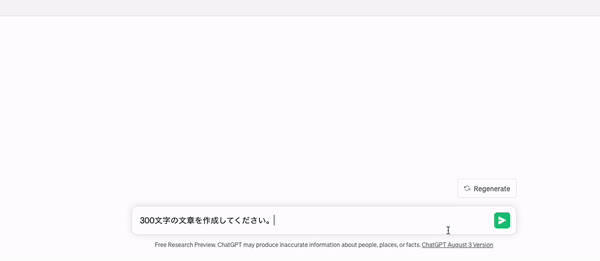

<!--
class: center invert
-->

## ChatGPTのクローンアプリを作って学んだStreaming UIについて

---

<!--
class: invert center
-->

## Goal

- ChatGPTライクなテキストがどんどん表示されるアレをどうやって実現するのかを知る

---

<!--
class: invert
-->

## 目次

- Streaming UIについて
  - SSEについて
- OpenAI APIについて
  - トークン制限とか
- 

---

## Streaming UI

※ 一般用語ではないが、[Vercelのドキュメント](https://sdk.vercel.ai/docs/concepts/streaming)から拝借

- サーバーからストリーム形式でレスポンスを受け取り、逐一UIに反映していく方法
- 対して、レスポンスが完全に返ってきてから一括で反映する方法はBlocking UI
  - レスポンスのサイズが大きくなるほど初期表示が遅くなりユーザー体験が悪化しやすい

---

## [SSE（Server-Sent-Event）](https://developer.mozilla.org/ja/docs/Web/API/Server-sent_events/Using_server-sent_events)

- サーバからクライアントに対してリアルタイムで「イベント」を送信することができる機能
  - 送信の単位をイベントと呼ぶ
- ChatGPTが1トークン生成するごとに、サーバから生成した文字列を含んだイベントを送信することで文章がどんどん表示されるようなUIが可能

---

## WebSocketとの比較

||SSE|WebSocket|
| --- | --- | --- |
|通信方法|サーバからクライアントへの一方向のみ|サーバーとクライアントの双方向で可能|
|実装コスト|HTTP/1.1 上で動作するので低い|独自プロトコル（HTTPの拡張）のため高い|

→ 双方向通信は不可能だが、実装コストは比較的低い
素のPHPで10数行程度で実装できる。([例](https://developer.mozilla.org/ja/docs/Web/API/Server-sent_events/Using_server-sent_events#%E3%82%B5%E3%83%BC%E3%83%90%E3%81%8B%E3%82%89%E3%81%AE%E3%82%A4%E3%83%99%E3%83%B3%E3%83%88%E3%81%AE%E9%80%81%E4%BF%A1))

---

