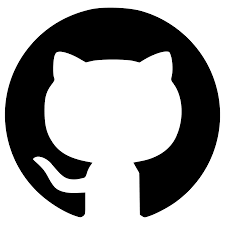

<!--
class: center
-->

# マルチレポだってスキーマ駆動開発がしたい！

---

<!--
class:
-->

## 話す人

- 横断 FE4G でトヨタシステムズに常駐
- AWS 勉強中（なにもわからない）

---

## スキーマ駆動開発とは？

- API のスキーマを最初に定義して、定義をもとに FE や BE の開発を進める開発手法
- はじめに API のスキーマ定義をするため、FE <-> BE 間における API 仕様のずれを防ぐことができる
- FE は API スキーマを参考に、BE の実装を待たずして作業を進められる

---

## トヨタシステムズ（TS）での課題と背景

- ①API 定義に Open API を利用しているが、API の型定義（呼び出し処理等）を自前で作成している
  - 作成・管理コストが都度発生
- ②FE と BE で Repo が独立しており（マルチレポ）、同じ型定義を別々に作成が必要
  - FE と BE での定義のずれ、認識齟齬が頻発

---

## 背景と課題

- ①API 定義に Open API を利用しているが、API の型定義を自前で用意している
  - 作成・管理コストが都度発生
  - ➡️ 型定義の自動生成ライブラリを利用して自動化したい
- ②FE と BE で Repo が独立しており、別々に作成が必要
  - FE と BE での定義のずれ、認識齟齬が頻発
  - ➡️Npm パッケージ化して FE と BE の Repo で共通化させたい

---

## ① クライアントコードの自動生成

ライブラリ選定

- 自動生成用のライブラリの選択肢はいくつかあるが今回は Orval を選定
  - API のクライアントコードだけでなく fetching ライブラリ（Tanstack Query, SWR）のカスタム hooks も自動生成可能
  - メンテナンスが活発
    - ※[Issue](https://github.com/anymaniax/orval/issues/1396) をあげたところ翌日には PR が上がってスムーズにマージされた

---

## ① クライアントコードの自動生成

その他のライブラリ

- [Open API Generator](https://github.com/OpenAPITools/openapi-generator)
  - この手のライブラリでは最も老舗っぽく、情報も多い
  - 出力されるファイルが多かったり、実行速度が比較的遅いなどの課題あり
- [Open API TypeScript](https://github.com/openapi-ts/openapi-typescript)
  - Orval の時点で選ぶならこれ
- [Swagger Codegen](https://github.com/swagger-api/swagger-codegen)
- [Swagger TypeScript API](https://github.com/acacode/swagger-typescript-api)
- ...etc

---

脱線

## Orval 語源

> ほかのトラピスト醸造所と違い、オルヴァル修道院が造っているビールはたった 1 種類だけ。敷地内にあるマチルドの泉には１０７６年にここを訪れたイタリアの伯爵夫人が結婚指輪を落とし、鱒がくわえて上がってきたという伝説が残っいる。

https://www.belgianbeer.co.jp/products/list.php?category_id=274

---

## ① クライアントコードの自動生成

Tips

---

## ② マルチレポでのパッケージ共有

Npm パッケージ管理・公開には **GitHub Packages** を利用。

- パッケージ化したコードを public または private にホストして利用することができる GitHub 公式のサービス
  - 特定の org 内でのみ利用可能なパッケージをホストすることができる
- npm や RubyGems などの各言語の標準的なパッケージ管理サービスをサポート

---

# ② マルチレポでのパッケージ共有

パッケージの公開・利用手順は 👇 記事が詳しい。（本 LT では割愛）

[GitHub Packages の npm レジストリを使って、社内 org 用のプライベートパッケージを公開する手順とインストールする手順](https://zenn.dev/moneyforward/articles/20230620-github-packages)

---

## コード自動生成＆パッケージ共有のイメージ

// miro の図を貼る

---

## 導入手順

パッケージ公開

- 新規 Repo 作成。Orval 等インストール、セットアップ
- PAT（Github Personal Token）作成
- パッケージ公開の CI 整備
  - パッケージのバージョン更新の基準にはセマンティックバージョニングを利用し、PR の Label でどの  バージョンの更新かを判定する方針をとる
  - PR に適切な Label が付与されているかをチェックする GHA は以下
  - バージョンを更新し、パッケージを公開する GHA は以下

---

## 悩み・苦労した点

- Npm パッケージをどのような形で公開するか？
  - JS にして公開するか、TS のまま公開するか？
  - モジュールはすべてバンドルするか？分けるとしたらパスはどう設計するか？
- クライアントコード自動生成ライブラリ＆マルチレポのケースの事例が少ない
  - Orval で生成した Tanstack Query の hooks コードをパッケージ化した際の呼び出しに一工夫必要(クエリキーや認証情報の渡し方等)

---

## 今後の展望

- FE・BE の既存コードのリファクタ（自作の型定義の置き換え）
- Tanstack Query のカスタム Hooks コードを自動生成したものに置き換え
- API の Mock データ（MSW）コードも自動生成したものに

➡️ API スキーマを追加すると、型定義＆API 処理のカスタム Hooks＆Mock データが全て自動生成されてスキーマ駆動開発が実現（理想）

---

## EOF
